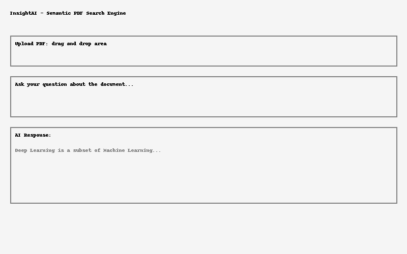

# InsightAI

**InsightAI** is an AI-powered semantic PDF intelligence engine. Upload your PDF documents and ask natural language questions. The engine will semantically search your documents using vector embeddings and return context-aware answers with OpenAI.



## 🚀 Features

- 📄 Multi-PDF ingestion
- 🧠 AI-powered semantic search (OpenAI)
- ⚡ Vector search with FAISS (or mock fallback)
- ⚙️ FastAPI-based backend
- 🧪 Pytest-compatible test suite
- 🐳 Docker support
- 🎯 MIT License

## 📦 Setup

```bash
pip install -r requirements.txt
uvicorn app.main:app --reload
```

## 🔐 .env Configuration

Create a `.env` file like:

```env
OPENAI_API_KEY=your-openai-key
```

## 📬 API Endpoints

### Upload PDF

`POST /upload/`

- Body: `file (PDF)`

### Query

`POST /query/`

```json
{
  "query": "What is deep learning?",
  "top_k": 1
}
```

### Root

`GET /`

## 🧪 Run Tests

```bash
pytest tests/
```

## 🐳 Docker

```bash
docker build -t insightai .
docker run -p 8000:8000 insightai
```

## 🤝 Contributing

Pull requests welcome. Please open issues for bugs or suggestions.

---

MIT License © 2025